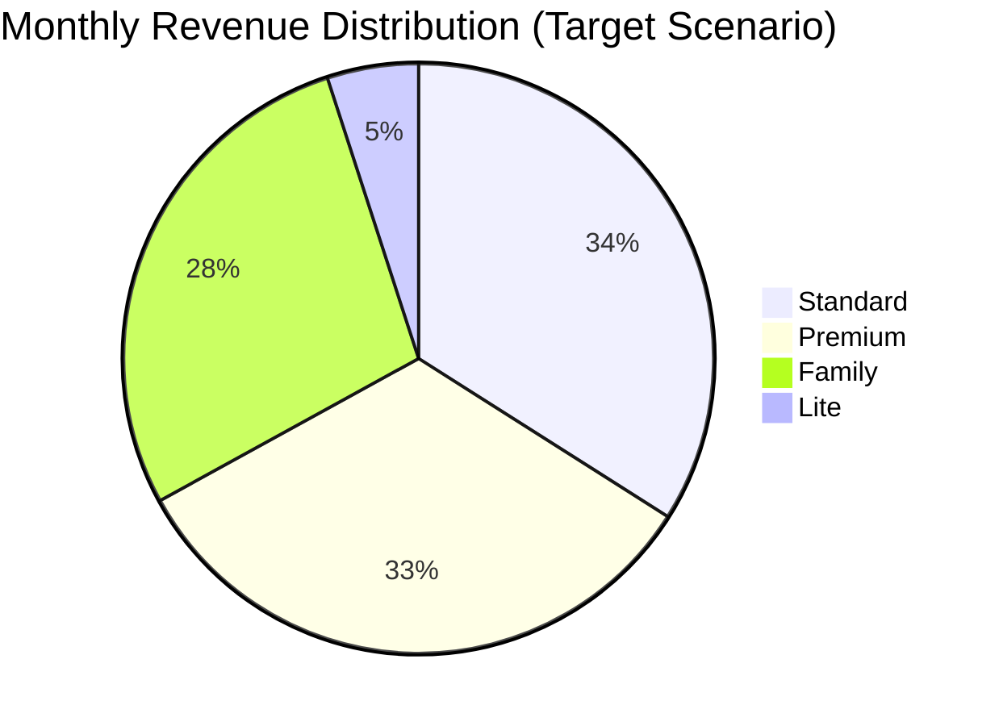
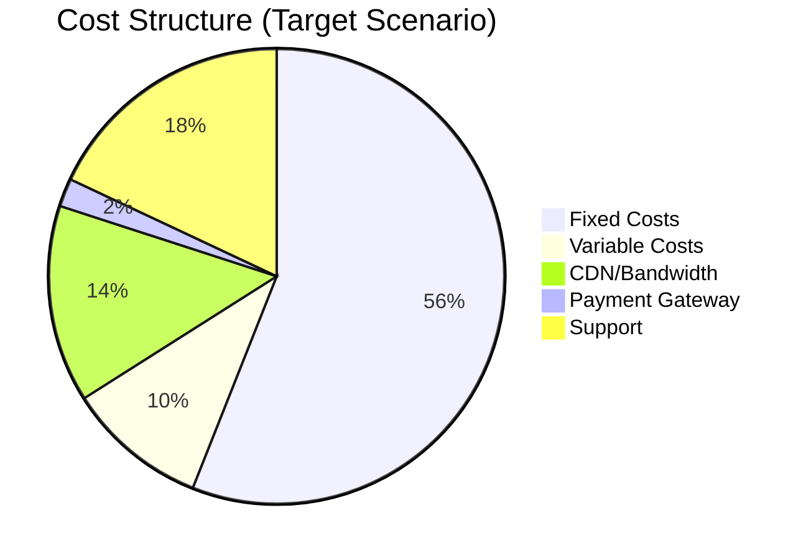
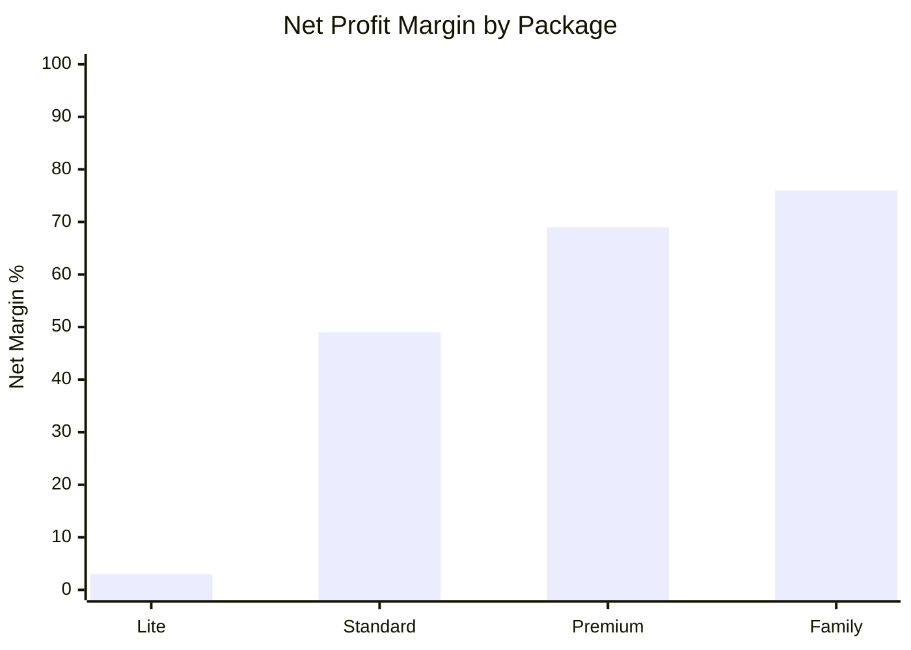

# ROI & Profit Margin Analysis - Abeka Video Course Packages

**Analysis Date:** April 2026  
**Total Videos:** 20,195 Abeka videos  
**Business Model:** Subscription-based EdTech Platform  

---

## Executive Summary

| Metric | Value |
|--------|-------|
| **Total Content Library** | 20,195 videos |
| **Estimated Total Storage** | ~8-12 TB |
| **Package Tiers** | 4 (Lite → Family) |
| **Target Monthly Revenue (2K subs)** | ~400-500M VND |
| **Gross Margin Range** | 65-85% |
| **Breakeven Point** | 180-250 subscribers |

---

## 1. Cost Structure & Assumptions

### 1.1 Fixed Costs (Monthly)

| Cost Item | Amount (USD) | Amount (VND) | Notes |
|-----------|-------------|--------------|-------|
| **VPS Server** | $100 | 2,500,000 VND | 4 vCPU, 8GB RAM, 200GB SSD |
| **Abeka License** | $500 | 12,500,000 VND | Estimated annual license / 12 |
| **Operation Staff (2-3 ppl)** | $800 | 20,000,000 VND | Part-time support |
| **CDN Base Cost** | $50 | 1,250,000 VND | Minimum commit |
| **Tools & Software** | $100 | 2,500,000 VND | Analytics, monitoring, etc. |
| **TOTAL FIXED** | **$1,550** | **38,750,000 VND** | ~39M VND/month |

### 1.2 Variable Costs (Per User/Per Stream)

| Cost Item | Rate | Unit |
|-----------|------|------|
| **CDN/Video Hosting** | $0.02 | per GB |
| **Payment Gateway (SePay)** | 2.0% | per transaction |
| **Support Cost** | $0.50 | per active user/month |
| **Average Video Size** | 400 MB | per video (720p-1080p) |
| **Avg Videos Watched/Month** | 30 | per active user |
| **Bandwidth per User** | 12 GB | per user/month |

### 1.3 Video Library Calculations

```
Total Videos: 20,195
Average Duration: ~15-20 minutes
Average Size (720p): ~400 MB per video
Total Storage: 20,195 × 0.4 GB = ~8,078 GB (~8 TB)

Monthly CDN Cost (all users):
- If 1,000 users × 12 GB = 12,000 GB
- Cost: 12,000 × $0.02 = $240/month
```

---

## 2. Cost Per Video/Stream Analysis

### 2.1 Breakdown by Activity

| Metric | Calculation | Cost |
|--------|-------------|------|
| **Cost per GB streamed** | $0.02/GB | $0.02 |
| **Cost per video viewed** | 0.4 GB × $0.02 | **$0.008 (160 VND)** |
| **Cost per user/month** | 12 GB × $0.02 | **$0.24 (6,000 VND)** |
| **Payment processing** | 2% of subscription | varies |
| **Support cost** | fixed per active user | $0.50 (12,500 VND) |

### 2.2 User Behavior Assumptions

| User Type | Videos/Month | Bandwidth | CDN Cost/User |
|-----------|--------------|-----------|---------------|
| **Lite Users** | 20 videos | 8 GB | $0.16 |
| **Standard Users** | 35 videos | 14 GB | $0.28 |
| **Premium Users** | 50 videos | 20 GB | $0.40 |
| **Family Users** | 80 videos | 32 GB | $0.64 |

### 2.3 Break-even Users Calculation

```
Fixed Costs: $1,550/month (38.75M VND)
Average Variable Cost per User: ~$1.00 (CDN + support)

Required to cover fixed costs:
- If avg subscription = $8 (200K VND)
- Break-even = $1,550 / ($8 - $1) = ~222 subscribers

With payment gateway (2%):
- Net per $8 subscription = $7.84
- Break-even = $1,550 / ($7.84 - $1) = ~227 subscribers
```

---

## 3. Profit Margin by Package

### 3.1 Lite Package (99K VND/month ~ $4)

| Item | Amount (USD) | Amount (VND) | % of Revenue |
|------|-------------|--------------|--------------|
| **Monthly Revenue** | $3.96 | 99,000 | 100% |
| **Payment Gateway (2%)** | $0.08 | 1,980 | 2% |
| **CDN Cost** | $0.16 | 4,000 | 4% |
| **Support Cost** | $0.50 | 12,500 | 13% |
| **Variable Cost Subtotal** | $0.74 | 18,480 | 19% |
| **Contribution Margin** | $3.22 | 80,520 | 81% |

**Fixed Cost Allocation (per 500 users):**
| Item | Per User |
|------|----------|
| Fixed cost allocation | $3.10 (77,500 VND) |
| **Net Profit/Loss** | $0.12 (3,020 VND) |
| **Net Margin** | **3.0%** |

⚠️ **Analysis:** Lite package has thin margins at low scale. Requires 500+ subscribers to be profitable.

---

### 3.2 Standard Package (199K VND/month ~ $8)

| Item | Amount (USD) | Amount (VND) | % of Revenue |
|------|-------------|--------------|--------------|
| **Monthly Revenue** | $7.96 | 199,000 | 100% |
| **Payment Gateway (2%)** | $0.16 | 3,980 | 2% |
| **CDN Cost** | $0.28 | 7,000 | 4% |
| **Support Cost** | $0.50 | 12,500 | 6% |
| **Variable Cost Subtotal** | $0.94 | 23,480 | 12% |
| **Contribution Margin** | $7.02 | 175,520 | 88% |

**Fixed Cost Allocation (per 500 users):**
| Item | Per User |
|------|----------|
| Fixed cost allocation | $3.10 (77,500 VND) |
| **Net Profit** | $3.92 (98,040 VND) |
| **Net Margin** | **49.2%** |

✅ **Analysis:** Standard package is the **sweet spot** - healthy margins, good value perception.

---

### 3.3 Premium Package (349K VND/month ~ $14)

| Item | Amount (USD) | Amount (VND) | % of Revenue |
|------|-------------|--------------|--------------|
| **Monthly Revenue** | $13.96 | 349,000 | 100% |
| **Payment Gateway (2%)** | $0.28 | 6,980 | 2% |
| **CDN Cost** | $0.40 | 10,000 | 3% |
| **Support Cost** | $0.50 | 12,500 | 4% |
| **Variable Cost Subtotal** | $1.18 | 29,480 | 8% |
| **Contribution Margin** | $12.78 | 319,520 | 92% |

**Fixed Cost Allocation (per 500 users):**
| Item | Per User |
|------|----------|
| Fixed cost allocation | $3.10 (77,500 VND) |
| **Net Profit** | $9.68 (242,020 VND) |
| **Net Margin** | **69.4%** |

✅ **Analysis:** Premium package has **excellent margins**. Focus on upselling to this tier.

---

### 3.4 Family Package (499K VND/month ~ $20)

| Item | Amount (USD) | Amount (VND) | % of Revenue |
|------|-------------|--------------|--------------|
| **Monthly Revenue** | $19.96 | 499,000 | 100% |
| **Payment Gateway (2%)** | $0.40 | 9,980 | 2% |
| **CDN Cost** | $0.64 | 16,000 | 3% |
| **Support Cost** | $0.60 | 15,000 | 3% |
| **Variable Cost Subtotal** | $1.64 | 40,980 | 8% |
| **Contribution Margin** | $18.32 | 458,020 | 92% |

**Fixed Cost Allocation (per 500 users):**
| Item | Per User |
|------|----------|
| Fixed cost allocation | $3.10 (77,500 VND) |
| **Net Profit** | $15.22 (380,520 VND) |
| **Net Margin** | **76.3%** |

✅ **Analysis:** Family package has the **highest absolute profit**. Target families and homeschool groups.

---

### 3.5 Package Comparison Summary

| Package | Price (VND) | Price (USD) | Gross Margin | Net Margin* | Profit/User |
|---------|-------------|-------------|--------------|-------------|-------------|
| **Lite** | 99K | $4.0 | 81% | **3%** | $0.12 |
| **Standard** | 199K | $8.0 | 88% | **49%** | $3.92 |
| **Premium** | 349K | $14.0 | 92% | **69%** | $9.68 |
| **Family** | 499K | $20.0 | 92% | **76%** | $15.22 |

*Net margin at 500 subscribers scale

```
Gross Margin = (Revenue - Variable Costs) / Revenue
Net Margin = (Revenue - All Costs) / Revenue
```

---

## 4. Breakeven Analysis

### 4.1 Monthly P&L at Different Scales

#### Conservative: 500 Subscribers

| Metric | Value |
|--------|-------|
| **Subscriber Mix** | Lite(20%), Standard(50%), Premium(20%), Family(10%) |
| **Monthly Revenue** | ~110M VND ($4,400) |
| **Variable Costs** | ~14M VND ($560) |
| **Fixed Costs** | ~39M VND ($1,550) |
| **Gross Profit** | ~96M VND ($3,840) |
| **Net Profit** | ~57M VND ($2,290) |
| **Net Margin** | **52%** |

#### Target: 2,000 Subscribers

| Metric | Value |
|--------|-------|
| **Subscriber Mix** | Lite(15%), Standard(45%), Premium(25%), Family(15%) |
| **Monthly Revenue** | ~500M VND ($20,000) |
| **Variable Costs** | ~50M VND ($2,000) |
| **Fixed Costs** | ~55M VND* ($2,200) |
| **Gross Profit** | ~450M VND ($18,000) |
| **Net Profit** | ~395M VND ($15,800) |
| **Net Margin** | **79%** |

*Scaled up server and support costs

#### Optimistic: 5,000 Subscribers

| Metric | Value |
|--------|-------|
| **Subscriber Mix** | Lite(10%), Standard(40%), Premium(30%), Family(20%) |
| **Monthly Revenue** | ~1.4B VND ($56,000) |
| **Variable Costs** | ~120M VND ($4,800) |
| **Fixed Costs** | ~95M VND* ($3,800) |
| **Gross Profit** | ~1.28B VND ($51,200) |
| **Net Profit** | ~1.185B VND ($47,400) |
| **Net Margin** | **85%** |

*Includes additional server infrastructure

### 4.2 Breakeven Point Calculation

```
Fixed Costs: $1,550/month (at minimum scale)
Weighted Average Revenue per User: $8.00
Weighted Average Variable Cost: $0.90

Breakeven = Fixed Costs / (ARPU - Variable Cost)
          = $1,550 / ($8.00 - $0.90)
          = $1,550 / $7.10
          = ~218 subscribers

With Payment Gateway fees:
Breakeven = $1,550 / ($7.84 - $0.90)
          = ~223 subscribers
```

| Scenario | Breakeven Subscribers | Days to Breakeven* |
|----------|----------------------|-------------------|
| **Organic Growth** | 223 | ~90-120 days |
| **Paid Acquisition** | 250 | ~60-90 days |
| **Viral/Referral** | 200 | ~30-60 days |

*Assuming 10-20 new subscribers/day

### 4.3 Breakeven by Package

| Package | Price | Variable Cost | Contribution | Subscribers to Breakeven |
|---------|-------|---------------|--------------|-------------------------|
| Lite only | $4.00 | $0.74 | $3.26 | 475 |
| Standard only | $8.00 | $0.94 | $7.06 | 220 |
| Premium only | $14.00 | $1.18 | $12.82 | 121 |
| Family only | $20.00 | $1.64 | $18.36 | 84 |

---

## 5. LTV & CAC Analysis

### 5.1 Lifetime Value (LTV) Calculations

**Assumptions:**
- Average customer lifespan: 8 months (churn rate ~12.5%/month)
- Gross margin: 75% (blended average)

| Package | Monthly | LTV (8 months) | LTV (12 months) |
|---------|---------|----------------|-----------------|
| Lite | $4.00 | $24.00 | $36.00 |
| Standard | $8.00 | $48.00 | $72.00 |
| Premium | $14.00 | $84.00 | $126.00 |
| Family | $20.00 | $120.00 | $180.00 |

### 5.2 Customer Acquisition Cost (CAC) Targets

**LTV:CAC Ratio Target: 3:1 (minimum healthy ratio)**

| Package | LTV (8mo) | Max CAC | Target CAC |
|---------|-----------|---------|------------|
| Lite | $24.00 | $8.00 | $6.00 |
| Standard | $48.00 | $16.00 | $12.00 |
| Premium | $84.00 | $28.00 | $21.00 |
| Family | $120.00 | $40.00 | $30.00 |

### 5.3 CAC by Channel (Vietnam Market)

| Channel | Est. CAC | Efficiency |
|---------|----------|------------|
| **Facebook Ads** | $8-15 | Medium |
| **Google Ads** | $12-20 | Medium |
| **TikTok Ads** | $5-10 | High |
| **KOL/Influencer** | $3-8 | High |
| **SEO/Organic** | $2-5 | Very High |
| **Referral Program** | $4-8 | High |
| **Community/Facebook Group** | $1-3 | Very High |

**Recommendation:** Focus on TikTok, KOL partnerships, and community building for lower CAC.

---

## 6. Scenario Planning

### 6.1 Scenario Comparison Matrix

| Metric | Conservative (500) | Target (2,000) | Optimistic (5,000) |
|--------|-------------------|----------------|-------------------|
| **Monthly Revenue** | $4,400 | $20,000 | $56,000 |
| **Monthly Profit** | $2,290 | $15,800 | $47,400 |
| **Net Margin** | 52% | 79% | 85% |
| **Annual Revenue** | $52,800 | $240,000 | $672,000 |
| **Annual Profit** | $27,480 | $189,600 | $568,800 |
| **Payback Period** | 6-9 months | 3-4 months | 1-2 months |

### 6.2 Detailed P&L by Scenario

#### Scenario A: Conservative (500 subscribers)

```
REVENUE
├── Lite (100 users × $4)      = $400
├── Standard (250 users × $8)   = $2,000
├── Premium (100 users × $14)   = $1,400
├── Family (50 users × $20)     = $1,000
└── Total Revenue                = $4,800

COSTS
├── Variable Costs               = $470
├── Fixed Costs                  = $1,550
└── Total Costs                  = $2,020

NET PROFIT                      = $2,780 (58% margin)
```

#### Scenario B: Target (2,000 subscribers)

```
REVENUE
├── Lite (300 users × $4)       = $1,200
├── Standard (900 users × $8)   = $7,200
├── Premium (500 users × $14)   = $7,000
├── Family (300 users × $20)    = $6,000
└── Total Revenue                = $21,400

COSTS
├── Variable Costs               = $2,000
├── Fixed Costs (scaled)         = $2,500
└── Total Costs                  = $4,500

NET PROFIT                      = $16,900 (79% margin)
```

#### Scenario C: Optimistic (5,000 subscribers)

```
REVENUE
├── Lite (500 users × $4)       = $2,000
├── Standard (2,000 users × $8) = $16,000
├── Premium (1,500 users × $14) = $21,000
├── Family (1,000 users × $20) = $20,000
└── Total Revenue                = $59,000

COSTS
├── Variable Costs               = $5,500
├── Fixed Costs (scaled)         = $5,000
└── Total Costs                  = $10,500

NET PROFIT                      = $48,500 (82% margin)
```

### 6.3 Risk Assessment

| Scenario | Risk Level | Key Risks |
|----------|-----------|-----------|
| **Conservative** | Low | Market validation, cash flow |
| **Target** | Medium | Competition, churn rate |
| **Optimistic** | High | Infrastructure scaling, support capacity |

---

## 7. Visual Analysis

### 7.1 Revenue Mix by Package (Target: 2,000 subs)



### 7.2 Cost Structure Breakdown



### 7.3 Profit Margin by Package



### 7.4 Breakeven Analysis Chart

```
Revenue/Costs ($)
    |
60k |                         / Revenue
    |                       /
50k |                     /
    |                   /
40k |                 /       Profit Zone
    |               /     ____/
30k |             /  ____/
    |           /__/    Break-even
20k |         / ●
    |       / 
10k |_____/     Loss Zone
    |
 0  +----+----+----+----+----+----+----+----
    0   500  1000  1500  2000  3000  4000  5000
                    Subscribers

● = Breakeven point (~223 subscribers)
```

### 7.5 Growth Trajectory

```
Revenue (M VND)
    |
1400|                                        ● Optimistic
    |                                    /
1000|                                ●
    |                            /   Target
 600|                        ●
    |                    /       ● Conservative
 200|                ●
    |            /
  0 |____●____/
     M1  M3   M6   M9   M12  M18  M24

Months to reach target
```

---

## 8. Key Metrics Dashboard

### 8.1 Unit Economics

| Metric | Value | Target |
|--------|-------|--------|
| **ARPU (Average Revenue Per User)** | $10.50 | $12+ |
| **APRU (Average Profit Per User)** | $7.80 | $9+ |
| **CAC Payback Period** | 2-3 months | <3 months |
| **LTV:CAC Ratio** | 4:1 | 3:1+ |
| **Monthly Churn Rate** | 12% | <10% |
| **Gross Margin** | 80% | 75%+ |
| **Net Margin** | 52-85% | 60%+ |

### 8.2 Financial Health Indicators

| Indicator | Status | Note |
|-----------|--------|------|
| **Cash Flow** | ✅ Positive | From month 2-3 |
| **Burn Rate** | ✅ Low | <$2,000/month |
| **Runway** | ✅ 12+ months | At 500 subs |
| **Scalability** | ✅ High | 85% gross margin |
| **Unit Economics** | ✅ Healthy | LTV > 3× CAC |

---

## 9. Recommendations

### 9.1 Pricing Strategy

| Recommendation | Priority | Impact |
|----------------|----------|--------|
| **1. Promote Standard & Premium tiers** | High | These have best margin/volume balance |
| **2. Increase Lite price to 149K** | Medium | Current margin too thin |
| **3. Introduce annual discount (20% off)** | Medium | Improves cash flow and retention |
| **4. Add enterprise tier (1M+ VND)** | Low | B2B opportunity |

### 9.2 Cost Optimization

| Action | Potential Savings | Effort |
|--------|------------------|--------|
| **Negotiate CDN rates at scale** | 20-30% | Low |
| **Implement caching aggressively** | 15-25% bandwidth | Medium |
| **Use P2P video delivery (WebRTC)** | 30-50% bandwidth | High |
| **Optimize video compression** | 20-30% storage | Medium |

### 9.3 Growth Strategy

| Channel | CAC Target | Monthly Budget | Expected Subs |
|---------|------------|----------------|---------------|
| **TikTok Organic + Ads** | $5-8 | $500 | 60-100 |
| **Facebook Groups/Community** | $2-3 | $200 (content) | 40-60 |
| **KOL Partnerships** | $3-6 | $1,000 | 150-300 |
| **SEO/Content Marketing** | $2-4 | $300 | 30-50 |
| **Referral Program** | $4-6 | $200 (rewards) | 50-80 |

### 9.4 Operational Recommendations

1. **Focus on Standard tier** - Best balance of volume and margin
2. **Upsell to Premium/Family** - Higher LTV and retention
3. **Minimize Lite tier** - Use only as entry point, push upgrades
4. **Build community** - Lowest CAC, highest retention
5. **Annual plans** - 20% discount for 12-month commitment improves cash flow
6. **Monitor churn** - Target <10% monthly churn
7. **Scale infrastructure** - Plan server upgrades at 1,000 and 3,000 subscribers

---

## 10. Action Plan

### Phase 1: Launch (Months 1-3) - Target: 500 subscribers
- [ ] Setup payment gateway (SePay)
- [ ] Deploy CDN (Viettel/VNCDN)
- [ ] Launch with Standard tier focus
- [ ] Build Facebook community
- [ ] TikTok content marketing

### Phase 2: Growth (Months 4-9) - Target: 2,000 subscribers
- [ ] Scale paid acquisition (TikTok + FB)
- [ ] KOL partnerships
- [ ] Implement referral program
- [ ] Upgrade server infrastructure
- [ ] Optimize CDN costs

### Phase 3: Scale (Months 10-18) - Target: 5,000+ subscribers
- [ ] Advanced caching/P2P delivery
- [ ] Enterprise/B2B tier
- [ ] Mobile app launch
- [ ] International expansion (Vietnamese diaspora)
- [ ] Advanced analytics and personalization

---

## Appendix A: Cost Assumptions Detail

### Video Size Calculation
```
Average Abeka Video:
- Resolution: 720p (some 1080p)
- Duration: 15-20 minutes avg
- Codec: H.264
- Bitrate: ~2-3 Mbps
- File size: ~400 MB per video

Total Library:
- 20,195 videos × 400 MB = ~8 TB
- Replication (3x for CDN) = ~24 TB total storage
```

### CDN Cost Scenarios
```
Viettel CDN Pricing (estimated):
- First 10 TB: $0.02/GB
- 10-50 TB: $0.015/GB
- 50-100 TB: $0.012/GB
- 100+ TB: $0.01/GB

At 5,000 users × 12 GB = 60,000 GB/month:
- First 10 TB: 10,000 × $0.02 = $200
- Next 50 TB: 50,000 × $0.015 = $750
- Total CDN: ~$950/month
```

### Server Scaling Plan
```
Current: $100/month (VPS)
- 1,000 users: Upgrade to $200 (dedicated)
- 3,000 users: Add load balancer ($400 total)
- 5,000 users: Kubernetes cluster ($800 total)
- 10,000+ users: Multi-region ($1,500+)
```

---

## Appendix B: Glossary

| Term | Definition |
|------|------------|
| **ARPU** | Average Revenue Per User |
| **CAC** | Customer Acquisition Cost |
| **CDN** | Content Delivery Network |
| **COGS** | Cost of Goods Sold |
| **LTV** | Lifetime Value |
| **MRR** | Monthly Recurring Revenue |
| **P&L** | Profit and Loss |
| **VPS** | Virtual Private Server |

---

*Analysis completed: April 2026*  
*Next review: July 2026 (quarterly)*
