# Executive Summary: Learning System Transformation

**Project:** hoctienganh.xyz Educational Platform  
**Document Version:** 1.0  
**Date:** March 31, 2026  
**Status:** Strategic Planning Document  

---

## Table of Contents

1. [Project Overview](#1-project-overview)
2. [Content Analysis Summary](#2-content-analysis-summary)
3. [Recommended Architecture](#3-recommended-architecture)
4. [Learning Path Strategy](#4-learning-path-strategy)
5. [Technical Implementation](#5-technical-implementation)
6. [Roadmap & Next Steps](#6-roadmap--next-steps)

---

## 1. Project Overview

### 1.1 Vision Statement

Transform hoctienganh.xyz from a video aggregation platform into an **intelligent, adaptive learning system** that guides 36,360 educational videos into personalized learning journeys for Vietnamese students aged 3-18+.

**Core Value Proposition:**
> *"From passive video watching to active, structured learning with measurable outcomes."*

### 1.2 Current State

| Metric | Value |
|--------|-------|
| **Total Videos** | 36,360 |
| **Content Sources** | 6 (Abeka, Littlefox EN, Littlefox CN, PlayTT, PlayGG, Phim) |
| **Collections** | 2,659 |
| **Grade Coverage** | K4-G12 (14 grades) |
| **Languages** | English, Chinese |
| **Current Model** | Video library with basic categorization |

### 1.3 Target State

| Capability | Current | Target |
|------------|---------|--------|
| Content Organization | Source-based | **Learning path-based** |
| User Progression | None | **5-level hierarchy with tracking** |
| Personalization | None | **Adaptive paths based on ability** |
| Assessment | None | **Milestone-based with spaced repetition** |
| Parent Visibility | Limited | **Comprehensive progress dashboards** |
| Cross-Source Integration | Manual | **Automated recommendations** |

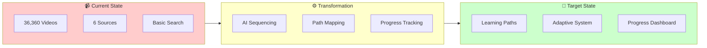

---

## 2. Content Analysis Summary

### 2.1 Content Inventory by Source

| Source | Collections | Videos | % of Total | Primary Purpose |
|--------|-------------|--------|------------|-----------------|
| **Abeka** | 2,380 | 20,195 | 55.5% | Core K-12 Curriculum |
| **Littlefox EN** | 136 | 8,718 | 24.0% | English Literature/Stories |
| **PlayTT** | 57 | 4,938 | 13.6% | Test Prep (IELTS) |
| **Littlefox CN** | 48 | 1,983 | 5.5% | Chinese Language |
| **PlayGG** | 26 | 514 | 1.4% | Supplementary |
| **Phim** | 12 | 12 | 0.03% | Entertainment (unavailable) |
| **TOTAL** | **2,659** | **36,360** | **100%** | |

### 2.2 Grade/Level Coverage Matrix

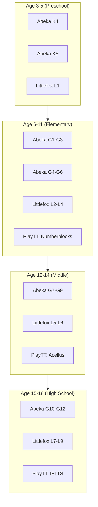

### 2.3 Content Categorization

| Category | Sources | Video Count | Description |
|----------|---------|-------------|-------------|
| **Core Curriculum** | Abeka | 20,195 | Structured K-12 academic subjects |
| **Literature/Stories** | Littlefox (EN+CN) | 10,701 | Animated stories, classics |
| **Test Preparation** | PlayTT | 4,938 | IELTS, standardized tests |
| **Supplementary** | PlayGG | 514 | General educational content |

### 2.4 Subject Taxonomy

All content classified into 9 primary domains:

```
┌─────────────────────────────────────────────────────────────┐
│                  UNIFIED SUBJECT TAXONOMY                     │
├─────────────────────────────────────────────────────────────┤
│                                                               │
│  ┌─────────────┐  ┌─────────────┐  ┌─────────────┐         │
│  │   MATH      │  │   ELA       │  │   SCIENCE   │         │
│  │ Arithmetic  │  │ Reading     │  │ Biology     │         │
│  │ Algebra     │  │ Writing     │  │ Chemistry   │         │
│  │ Geometry    │  │ Phonics     │  │ Physics     │         │
│  └─────────────┘  └─────────────┘  └─────────────┘         │
│                                                               │
│  ┌─────────────┐  ┌─────────────┐  ┌─────────────┐         │
│  │   SOCIAL    │  │   LANGUAGE  │  │   TEST      │         │
│  │   STUDIES   │  │   ARTS      │  │   PREP      │         │
│  │ History     │  │ English     │  │ IELTS       │         │
│  │ Geography   │  │ Chinese     │  │ TOEFL       │         │
│  └─────────────┘  └─────────────┘  └─────────────┘         │
│                                                               │
│  ┌─────────────┐  ┌─────────────┐  ┌─────────────┐         │
│  │   ARTS      │  │   LIFE      │  │   STORIES   │         │
│  │   & MUSIC   │  │   SKILLS    │  │   & LIT     │         │
│  │ Art         │  │ Bible       │  │ Fairy Tales │         │
│  │ Music       │  │ Penmanship  │  │ Classics    │         │
│  └─────────────┘  └─────────────┘  └─────────────┘         │
│                                                               │
└─────────────────────────────────────────────────────────────┘
```

---

## 3. Recommended Architecture

### 3.1 5-Level Hierarchy

Based on research of Duolingo, Coursera, and Khan Academy architectures:

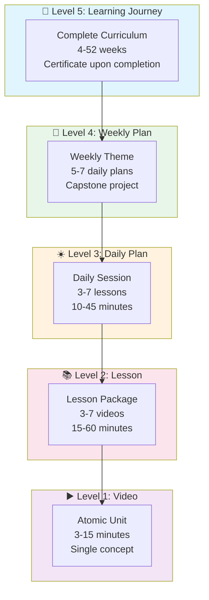

### 3.2 Hierarchy Specifications

| Level | Unit | Duration | Content Count | Purpose |
|-------|------|----------|---------------|---------|
| **Journey** | Curriculum/Course | 4-52 weeks | Multiple weekly plans | Long-term goal achievement |
| **Weekly Plan** | Week | 5-15 hours | 5-7 daily plans | Progress pacing with milestones |
| **Daily Plan** | Day | 10-45 min | 3-7 lessons | Manageable cognitive load |
| **Lesson** | Module | 15-60 min | 3-7 videos | Complete concept coverage |
| **Video** | Atomic | 3-15 min | 1 | Streaming & tracking unit |

### 3.3 Data Models

#### Core Entity Relationships

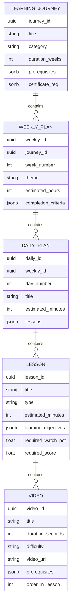

#### User Progress Model

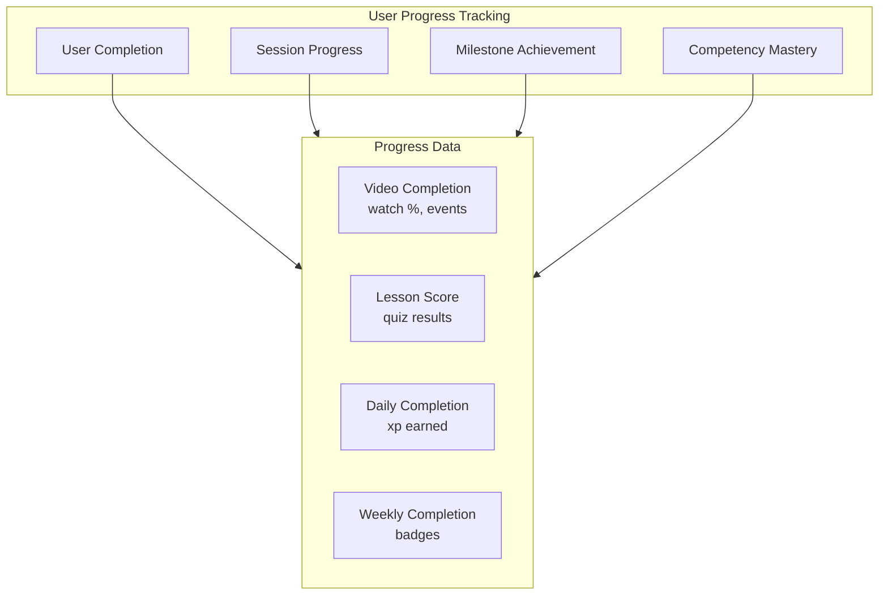

### 3.4 System Components

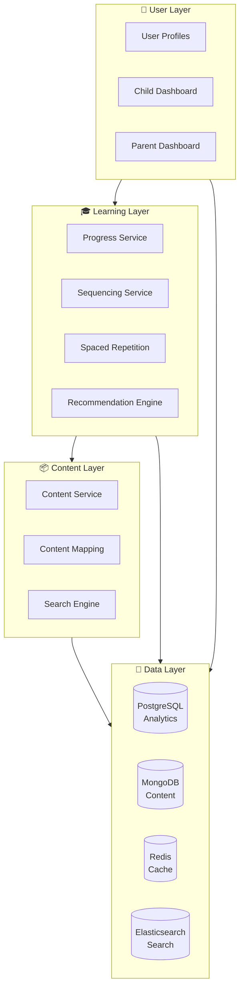

### 3.5 Component Responsibilities

| Component | Technology | Responsibility |
|-------------|------------|----------------|
| **Content Service** | Node.js/FastAPI | CRUD for content hierarchy |
| **Progress Service** | Node.js | Track completion, streaks, XP |
| **Sequencing Service** | Python | Generate adaptive paths |
| **Spaced Repetition** | Python | HLR algorithm, review scheduling |
| **Recommendation Engine** | ML/Python | Cross-source content suggestions |
| **Parent Dashboard** | React/Next.js | Progress visibility, controls |
| **Child Interface** | React/Expo | Learning experience, gamification |

---

## 4. Learning Path Strategy

### 4.1 Four Main Path Types

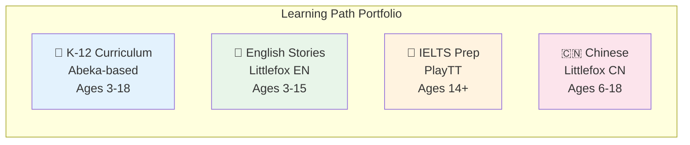

### 4.2 Path Type Specifications

| Path Type | Primary Source | Target Age | Duration | Videos |
|-----------|----------------|------------|----------|--------|
| **K-12 Curriculum** | Abeka | 3-18 | 14 years | 20,195 |
| **English Stories** | Littlefox EN | 3-15 | 9 levels | 8,718 |
| **IELTS Preparation** | PlayTT | 14+ | 12-16 weeks | 215+ |
| **Chinese Learning** | Littlefox CN | 6-18 | 5 levels | 1,983 |

### 4.3 Sample Learning Journeys

#### Journey A: Kindergarten Readiness (Age 4-5)

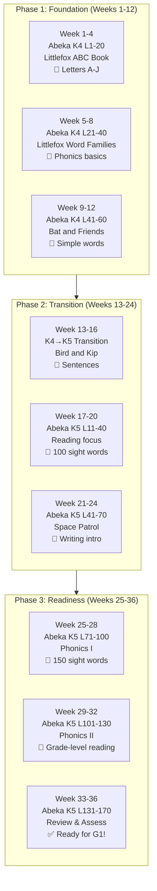

**Summary:**
- **Duration:** 36 weeks
- **Daily Time:** 30-45 minutes
- **Total Videos:** ~430 (230 Abeka lessons + 200 Littlefox episodes)
- **Outcomes:** Reading readiness, basic arithmetic, 200+ vocabulary

#### Journey B: IELTS Band 7.0 Achiever (Age 16-18)

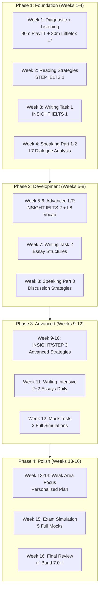

**Summary:**
- **Duration:** 16 weeks (intensive)
- **Daily Time:** 2-3 hours
- **Total Videos:** 215+ IELTS + 120+ Littlefox L7-L9
- **Outcomes:** Band 7.0+ IELTS score, 2,000+ academic words

#### Journey C: Bilingual Scholar (Age 10-14)

```
┌─────────────────────────────────────────────────────────────────────────────┐
│            JOURNEY: BILINGUAL SCHOLAR (Ages 10-14)                        │
│                       Duration: 40 Weeks                                    │
├─────────────────────────────────────────────────────────────────────────────┤
│                                                                             │
│  SEMESTER 1: FOUNDATION (Weeks 1-20)                                        │
│  ┌─────────────────────────────────────────────────────────────────────┐   │
│  │ ENGLISH: Abeka G5 (60m/day)        │  CHINESE: Littlefox CN L2 (30m)│   │
│  ├─────────────────────────────────────┼─────────────────────────────────┤   │
│  │ Weeks 1-5: Grammar & Sentences      │  Mrs. Kelly's Class             │   │
│  │ Weeks 6-10: Narrative Skills      │  Simple Stories                 │   │
│  │ Weeks 11-15: Academic Content     │  Story Series Start             │   │
│  │ Weeks 16-20: Writing Development  │  Character Writing              │   │
│  │ Milestone: 300 chars, grammar     │  ✓ Basic conversations          │   │
│  └─────────────────────────────────────────────────────────────────────┘   │
│                                                                             │
│  SEMESTER 2: ADVANCED (Weeks 21-40)                                       │
│  ┌─────────────────────────────────────────────────────────────────────┐   │
│  │ ENGLISH: Abeka G6-G7 (60m/day)     │  CHINESE: Littlefox CN L3-L4   │   │
│  ├─────────────────────────────────────┼─────────────────────────────────┤   │
│  │ Weeks 21-25: Literature & Culture │  Cinderella (CN) + Culture     │   │
│  │ Weeks 26-30: Advanced Grammar      │  Rocket Girl - Narrative       │   │
│  │ Weeks 31-35: STEM Bilingual        │  Science-themed Episodes     │   │
│  │ Weeks 36-40: Mastery & Integration│  Complete + Review             │   │
│  │ Milestone: 1,200 chars, G7 topics │  ✓ HSK 3-4 Equivalent          │   │
│  └─────────────────────────────────────────────────────────────────────┘   │
│                                                                             │
│  TOTALS: 360 hours | G5-G7 + L2-L4 | 1,500+ Chinese characters            │
│                                                                             │
└─────────────────────────────────────────────────────────────────────────────┘
```

### 4.4 Cross-Source Integration Matrix

| Primary Content | Complementary Source | Integration Purpose |
|-----------------|---------------------|---------------------|
| Abeka Math | Numberblocks (PlayTT) | Visual math concepts |
| Abeka Reading | Littlefox EN | Extensive reading practice |
| Abeka Science | Littlefox L3-L4 | Science-themed stories |
| PlayTT IELTS | Littlefox L6-L9 | Academic vocabulary |
| Littlefox CN | Abeka Writing | Character writing practice |

### 4.5 Prerequisite Chain Example

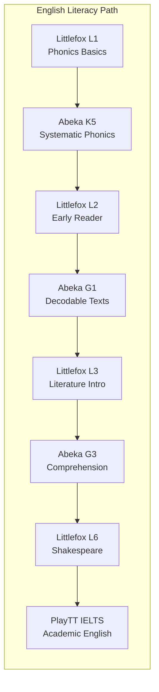

---

## 5. Technical Implementation

### 5.1 Database Extensions Required

#### New Tables for Learning System

```sql
-- Core Learning Path Tables
CREATE TABLE learning_path (
    path_id UUID PRIMARY KEY DEFAULT gen_random_uuid(),
    path_code VARCHAR(50) UNIQUE NOT NULL,
    path_name VARCHAR(100) NOT NULL,
    path_type VARCHAR(50) NOT NULL,
    description TEXT,
    target_age_min INT,
    target_age_max INT,
    estimated_duration_weeks INT,
    is_active BOOLEAN DEFAULT true,
    created_at TIMESTAMP DEFAULT CURRENT_TIMESTAMP
);

CREATE TABLE learning_journey (
    journey_id UUID PRIMARY KEY DEFAULT gen_random_uuid(),
    path_id UUID REFERENCES learning_path(path_id),
    title VARCHAR(100) NOT NULL,
    description TEXT,
    duration_weeks INT,
    prerequisites JSONB,
    certificate_requirements JSONB,
    created_at TIMESTAMP DEFAULT CURRENT_TIMESTAMP
);

CREATE TABLE weekly_plan (
    weekly_id UUID PRIMARY KEY DEFAULT gen_random_uuid(),
    journey_id UUID REFERENCES learning_journey(journey_id),
    week_number INT NOT NULL,
    title VARCHAR(100),
    theme VARCHAR(100),
    estimated_hours INT,
    completion_criteria JSONB
);

CREATE TABLE daily_plan (
    daily_id UUID PRIMARY KEY DEFAULT gen_random_uuid(),
    weekly_id UUID REFERENCES weekly_plan(weekly_id),
    day_number INT NOT NULL,
    title VARCHAR(100),
    estimated_minutes INT,
    lessons JSONB  -- Array of lesson references
);

-- User Progress Tables
CREATE TABLE user_learning_path (
    enrollment_id UUID PRIMARY KEY DEFAULT gen_random_uuid(),
    user_id UUID REFERENCES users(id),
    path_id UUID REFERENCES learning_path(path_id),
    enrolled_at TIMESTAMP DEFAULT CURRENT_TIMESTAMP,
    started_at TIMESTAMP,
    completed_at TIMESTAMP,
    current_progress_percent INT DEFAULT 0,
    status VARCHAR(20) DEFAULT 'enrolled'
);

CREATE TABLE user_progress (
    progress_id UUID PRIMARY KEY DEFAULT gen_random_uuid(),
    user_id UUID REFERENCES users(id),
    content_type VARCHAR(50) NOT NULL,  -- 'video', 'lesson', 'daily', 'weekly'
    content_id UUID NOT NULL,
    status VARCHAR(20) NOT NULL,  -- 'not_started', 'in_progress', 'completed'
    progress_percentage DECIMAL(5,2),
    xp_earned INT DEFAULT 0,
    completed_at TIMESTAMP,
    updated_at TIMESTAMP DEFAULT CURRENT_TIMESTAMP
);

-- Spaced Repetition Tables
CREATE TABLE review_schedule (
    schedule_id UUID PRIMARY KEY DEFAULT gen_random_uuid(),
    user_id UUID REFERENCES users(id),
    content_id UUID NOT NULL,
    next_review_at TIMESTAMP NOT NULL,
    half_life_days DECIMAL(6,2),
    predicted_recall DECIMAL(3,2),
    created_at TIMESTAMP DEFAULT CURRENT_TIMESTAMP
);

CREATE INDEX idx_review_schedule_user_date 
ON review_schedule(user_id, next_review_at) 
WHERE next_review_at <= NOW();
```

### 5.2 API Requirements

#### Essential Endpoints

| Endpoint | Method | Purpose |
|----------|--------|---------|
| `/api/learning-paths` | GET | List available paths |
| `/api/learning-paths/{id}` | GET | Get path details |
| `/api/children/{id}/enroll` | POST | Enroll child in path |
| `/api/children/{id}/progress` | GET | Get learning progress |
| `/api/next-content` | GET | Get recommended next video |
| `/api/complete-content` | POST | Mark content complete |
| `/api/reviews` | GET | Get spaced repetition reviews |
| `/api/prerequisites/{id}` | GET | Check prerequisites |

### 5.3 Integration Strategy

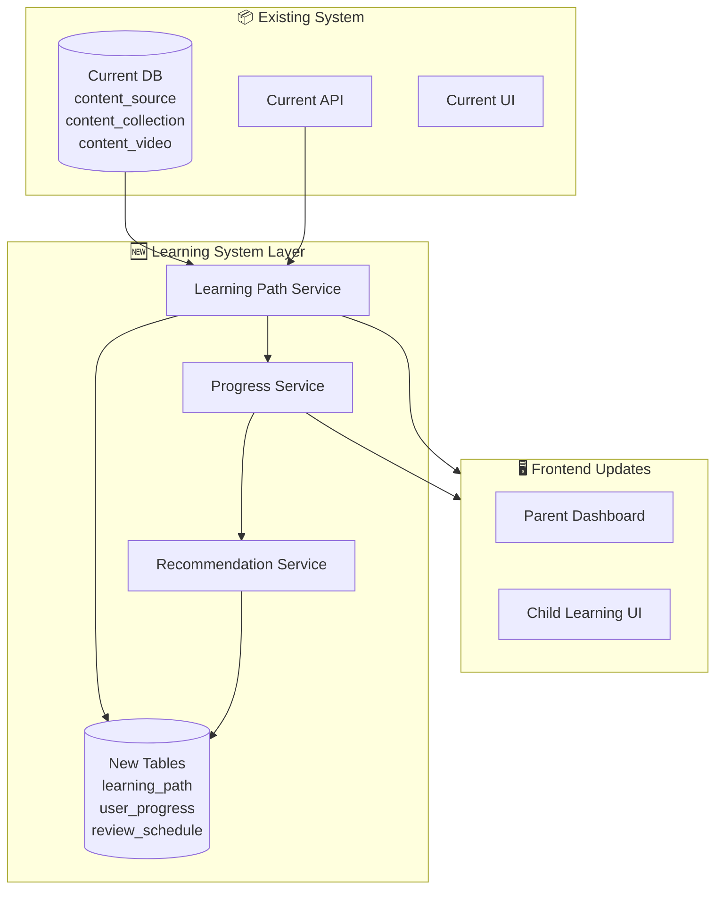

### 5.4 Technology Recommendations

| Layer | Technology | Justification |
|-------|------------|---------------|
| **API Backend** | FastAPI (Python) | Async support, type hints, auto-docs |
| **Database** | PostgreSQL + MongoDB | Relational for analytics, document for content |
| **Cache** | Redis | Streak tracking, session management |
| **Search** | Elasticsearch | Content discovery, recommendations |
| **Frontend** | Next.js + React | SSR for SEO, SPA for UX |
| **Mobile** | React Native | Cross-platform learning app |
| **ML/AI** | Python + scikit-learn | HLR algorithm, recommendations |

---

## 6. Roadmap & Next Steps

### 6.1 Implementation Phases

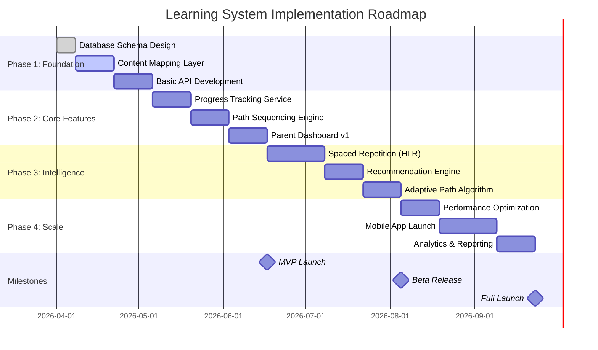

### 6.2 Phase Details

#### Phase 1: Foundation (Weeks 1-5)
**Focus:** Content infrastructure and basic hierarchy
- Design database schema for 5-level hierarchy
- Create content mapping layer (existing videos → new structure)
- Build basic CRUD APIs for learning paths
- **Deliverable:** Content hierarchy API operational

#### Phase 2: Core Features (Weeks 6-11)
**Focus:** User progress and path management
- Implement progress tracking service
- Build sequencing engine for linear paths
- Create parent dashboard v1 (progress visibility)
- **Deliverable:** Students can follow paths, parents see progress

#### Phase 3: Intelligence (Weeks 12-18)
**Focus:** Adaptive learning and personalization
- Implement HLR-based spaced repetition
- Build recommendation engine for cross-source content
- Create adaptive path algorithm (difficulty adjustment)
- **Deliverable:** System adapts to individual learner needs

#### Phase 4: Scale (Weeks 19-24)
**Focus:** Performance and mobile experience
- Optimize database queries for 36K+ videos
- Launch mobile learning app
- Build comprehensive analytics and reporting
- **Deliverable:** Full-featured learning platform

### 6.3 Success Metrics

| Metric | Baseline | Phase 1 | Phase 2 | Phase 3 | Phase 4 |
|--------|----------|---------|---------|---------|---------|
| **Videos in Paths** | 0% | 25% | 60% | 85% | 100% |
| **Active Learners** | 0 | 100 | 500 | 2,000 | 5,000+ |
| **Avg Session Time** | N/A | 15 min | 25 min | 30 min | 35 min |
| **Completion Rate** | N/A | 40% | 55% | 70% | 80% |
| **Parent Engagement** | 0% | 30% | 50% | 70% | 85% |
| **Retest Score Improvement** | N/A | N/A | +10% | +20% | +25% |

### 6.4 Key Performance Indicators (KPIs)

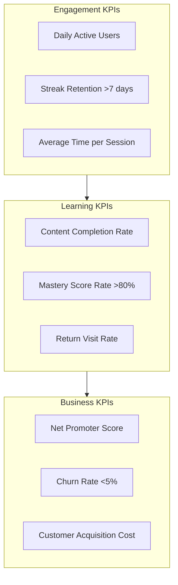

### 6.5 Risk Assessment

| Risk | Impact | Likelihood | Mitigation |
|------|--------|------------|------------|
| **Content Quality Variations** | High | Medium | Standardize with metadata tagging |
| **User Adoption Resistance** | High | Medium | Gradual rollout, parent education |
| **Performance with 36K Videos** | Medium | Low | Caching strategy, CDN optimization |
| **Cross-Source Integration Complexity** | Medium | High | Phase 1 focus on Abeka only |
| **Data Migration Errors** | High | Low | Comprehensive testing, rollback plan |

### 6.6 Immediate Next Steps (Week 1-2)

1. **Database Schema Finalization**
   - Review and approve schema designs
   - Set up migration scripts

2. **Proof of Concept**
   - Map 100 Abeka lessons to new hierarchy
   - Build minimal path sequencing demo

3. **Stakeholder Alignment**
   - Present architecture to development team
   - Gather feedback from content curators

4. **Infrastructure Setup**
   - Provision development environment
   - Set up CI/CD pipeline for new services

---

## Appendices

### A. Content Source Summary

| Source | Videos | Collections | Host | Format | Status |
|--------|--------|-------------|------|--------|--------|
| Abeka | 20,195 | 2,380 | fileta.hoctienganh.xyz | HLS | Active |
| Littlefox EN | 8,718 | 136 | cdn.littlefox.com | HLS | Active |
| Littlefox CN | 1,983 | 48 | cdn.littlefox.com | HLS | Active |
| PlayTT | 4,938 | 57 | fileta.hoctienganh.xyz | HLS | Active |
| PlayGG | 514 | 26 | rclone2.2tech.vn | MP4 | Active |
| Phim | 12 | 12 | vip.opstream*.com | HLS | Unavailable |

### B. Difficulty Alignment Matrix

| Universal Level | Age | Abeka | Littlefox EN | Littlefox CN | CEFR | HSK |
|-----------------|-----|-------|--------------|--------------|------|-----|
| BEG | 3-5 | K4-K5 | L1 | L1 | Pre-A1 | - |
| ELEM1 | 5-7 | G1-G2 | L2 | L2 | A1 | 1 |
| ELEM2 | 7-9 | G3-G4 | L3 | L3 | A2 | 2 |
| INT1 | 9-11 | G5-G6 | L4 | L4 | B1 | 3 |
| INT2 | 11-13 | G7-G8 | L5 | L5 | B1+ | 4 |
| ADV1 | 13-15 | G9-G10 | L6 | - | B2 | 5 |
| ADV2 | 15-17 | G11-G12 | L7 | - | B2+ | 6 |
| PROF | 17+ | - | L8-L9 | - | C1+ | - |

### C. Glossary

| Term | Definition |
|------|------------|
| **HLR** | Half-Life Regression - Duolingo's spaced repetition algorithm |
| **Learning Journey** | Complete curriculum from start to certificate |
| **Daily Plan** | Micro-learning session (10-45 min) |
| **CEFR** | Common European Framework of Reference for Languages |
| **HSK** | Hanyu Shuiping Kaoshi (Chinese proficiency test) |
| **Path** | Structured sequence of content leading to a goal |

---

*Document prepared by ClaudeKit Content Strategy Team*  
*Based on research from educational content analysis, learning system architecture research, and resource mapping studies*  
*For questions: Contact product strategy team*

---

**Unresolved Questions:**

1. What is the timeline for restoring Phim content availability?
2. Should we implement live session integration (Zoom/streaming) alongside recorded content?
3. What is the target date for Beta release with real users?
4. What budget is allocated for ML/AI recommendation infrastructure?
5. Are there specific compliance requirements for Vietnamese educational platforms?
