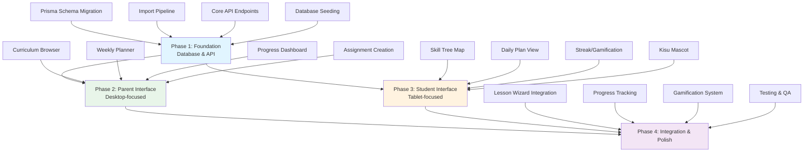

# Abeka Curriculum Organization System - Master Plan

## Executive Summary

This plan implements a comprehensive curriculum organization system for the Abeka Academy video library (20,195 videos, 14 grades K4-12, 170 lessons per grade). The system transforms raw video assets into a structured, navigable learning experience with parent planning tools and student engagement interfaces.

### Key Metrics
- **20,195** total videos to organize
- **14** grade levels (K4, K5, 1-12)
- **~170** lessons per grade
- **5-level** content hierarchy
- **27** new Prisma models
- **~120h** estimated effort

---

## System Architecture Overview

### Content Hierarchy (5-Level)

```
Level 5: Learning Journey (Parent-defined path)
    ↓
Level 4: Weekly Plan (7 days of learning)
    ↓
Level 3: Daily Plan (Day's assignments)
    ↓
Level 2: Lesson Package (Subject bundle)
    ↓
Level 1: Individual Video (Smallest unit)
```

### Data Flow Architecture

```
┌─────────────────────────────────────────────────────────────────┐
│                     Abeka JSON Assets                           │
│         (docs/api/abeka/{grade}/{lesson}.json)                  │
└───────────────────────────┬─────────────────────────────────────┘
                            │
                            ▼
┌─────────────────────────────────────────────────────────────────┐
│                  Import Pipeline                                │
│  • JSON Parser → Video Extractor → Lesson Builder → Seeder      │
└───────────────────────────┬─────────────────────────────────────┘
                            │
                            ▼
┌─────────────────────────────────────────────────────────────────┐
│                 Prisma Database (27 models)                     │
│                                                                 │
│  ┌─────────────┐ ┌─────────────┐ ┌─────────────┐ ┌───────────┐  │
│  │  AbekaVideo │ │AbekaLesson  │ │AbekaGrade   │ │AbekaSubject│  │
│  └──────┬──────┘ └──────┬──────┘ └──────┬──────┘ └─────┬─────┘  │
│         │               │               │              │       │
│  ┌──────▼──────┐ ┌──────▼──────┐ ┌──────▼──────┐ ┌──────▼──────┐│
│  │ChildProgress│ │ParentPlan   │ │DailyPlan    │ │WeeklyPlan   ││
│  └─────────────┘ └─────────────┘ └─────────────┘ └─────────────┘│
│                                                                 │
│  ┌─────────────┐ ┌─────────────┐ ┌─────────────┐ ┌───────────┐  │
│  │Gamification │ │SkillTree    │ │Assignment   │ │Streak     │  │
│  └─────────────┘ └─────────────┘ └─────────────┘ └───────────┘  │
└─────────────────────────────────────────────────────────────────┘
                            │
                            ▼
┌─────────────────────────────────────────────────────────────────┐
│                    API Layer (Next.js App Router)                 │
│                                                                 │
│  • /api/abeka/curriculum/*    • /api/abeka/progress/*          │
│  • /api/abeka/plans/*         • /api/abeka/gamification/*       │
└───────────────────────────┬─────────────────────────────────────┘
                            │
                            ▼
┌─────────────────────────────────────────────────────────────────┐
│                   Frontend (React + TypeScript)                 │
│                                                                 │
│  ┌─────────────┐ ┌─────────────┐ ┌─────────────┐ ┌───────────┐  │
│  │Parent       │ │Student      │ │Curriculum   │ │Lesson     │  │
│  │Dashboard    │ │Skill Tree   │ │Browser      │ │Wizard     │  │
│  └─────────────┘ └─────────────┘ └─────────────┘ └───────────┘  │
└─────────────────────────────────────────────────────────────────┘
```

---

## Phase Dependencies



---

## Phase Summary

| Phase | Name | Duration | Effort | Parallel? | Dependencies |
|-------|------|----------|--------|-----------|--------------|
| 1 | Foundation | Week 1-2 | 40h | No | None (base layer) |
| 2 | Parent Interface | Week 2-3 | 30h | Yes (after P1 DB) | Phase 1 DB/API |
| 3 | Student Interface | Week 2-3 | 30h | Yes (after P1 DB) | Phase 1 DB/API |
| 4 | Integration | Week 3-4 | 20h | No | Phases 2 & 3 |

### Parallel Execution Strategy

```
Week 1: [████] Phase 1 (Foundation - Sequential)
Week 2: [████] Phase 2 (Parent) ─┐
        [████] Phase 3 (Student) ─┴── Parallel after DB ready
Week 3: [████] Phase 4 (Integration - Sequential)
```

---

## Deliverables Checklist

### Phase 1 Deliverables
- [ ] Prisma schema migration (27 models)
- [ ] Abeka JSON import pipeline
- [ ] Core curriculum API endpoints
- [ ] Database seeding script for all 14 grades
- [ ] Unit tests for import pipeline
- [ ] API documentation

### Phase 2 Deliverables
- [ ] Curriculum browser with filters
- [ ] Weekly planner with drag-drop
- [ ] Child progress dashboard
- [ ] Assignment creation flow
- [ ] Parent dashboard responsive design

### Phase 3 Deliverables
- [ ] Skill tree learning map
- [ ] Daily plan view interface
- [ ] Streak/gamification display
- [ ] Kisu mascot integration
- [ ] Tablet-optimized UI

### Phase 4 Deliverables
- [ ] Lesson Wizard integration (existing video player)
- [ ] Progress tracking implementation
- [ ] Gamification system activation
- [ ] E2E test suite
- [ ] Performance optimization
- [ ] Production deployment checklist

---

## Risk Assessment

| Risk | Probability | Impact | Mitigation |
|------|-------------|--------|------------|
| Data inconsistency in Abeka JSON | Medium | High | Validation pipeline + error logs |
| Performance with 20K videos | Medium | High | Pagination + caching + indexing |
| Complex hierarchy queries | Low | Medium | Query optimization + denormalization |
| Parent/Student UI conflicts | Low | Medium | Separate route namespaces |
| Migration rollback needed | Low | High | Backup + reversible migrations |

---

## Technical Stack

- **Database**: PostgreSQL 16 + Prisma ORM
- **Backend**: Next.js 16 App Router + TypeScript
- **Frontend**: React 19 + Tailwind CSS + shadcn/ui
- **State**: Zustand + React Query
- **Drag/Drop**: @dnd-kit/core
- **Animation**: Framer Motion
- **Testing**: Vitest + Playwright

---

## File Ownership Matrix

See: [file-ownership-matrix.md](./file-ownership-matrix.md)

## Phase Details

- Phase 1: [phase-01-foundation.md](./phase-01-foundation.md)
- Phase 2: [phase-02-parent-interface.md](./phase-02-parent-interface.md)
- Phase 3: [phase-03-student-interface.md](./phase-03-student-interface.md)
- Phase 4: [phase-04-integration-polish.md](./phase-04-integration-polish.md)

---

## Implementation Command

```bash
# Execute full implementation
ck cook plans/260403-abeka-curriculum-system/
```

---

## Notes

- CDN videos hosted at: `https://fileta.hoctienganh.xyz/abk/`
- Abeka JSON data: `docs/api/abeka/{grade}/{lesson}.json`
- UI copy in Vietnamese per project policy
- Kisu mascot assets in: `public/mascots/kisu/`
