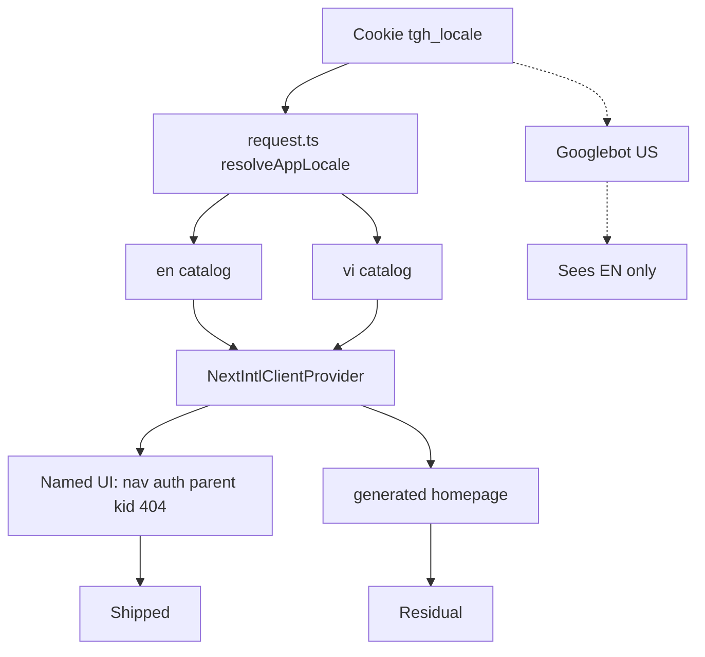

# Brainstorm: i18n EN/VI status and next move

Exploration only. No implementation.

## Contract

- **Outcome:** Honest status of EN/VI. If more work: `tgh_locale=vi` shows Vietnamese on in-scope UI without EN islands; `tgh_locale=en` English; default EN; no kernel ADR change.
- **Constraints:** next-intl cookie (no URL prefix, locked in leftover-mix plan). `translate()` / `useTranslations()`. Files ≤200 lines. `pnpm check:i18n` no diacritics in `src/`. Catalogs stay EN/VI key-parity. Kernel: parent login only.
- **Non-goals:** Child login. Admin CRUD translation. CMS `titleVi` rewrite. Purge all `generated.*` unless chosen. Transactional email unless chosen. Locale prefixes unless chosen.
- **Acceptance (status task):** Scout + research + this contract. Files on disk. Verdict: leftover-mix **shipped**; remaining is optional residual / SEO.

## Evidence (not intent)

- PR #23 merged 2026-09-05. Commit `ed8e4106` on `main`.
- Catalogs 6024/6024, 0 drift.
- 116 wired UI files. 404/500/auth/parent/kid HUD/courses chrome wired.
- README + codebase-summary still say leftover is unmerged PR #23 — **false**.
- `plan.md` leftover-mix still `pending` — **false**.
- Residual: homepage `generated.*` + EN metadata; emails EN; `Xong`/`Sai` literals; blog `titleVi` always; admin EN + `vi-VN` dates.
- Cookie locale = official next-intl. Cookie locale ≠ Google multilingual SEO.

## Approaches

### 1. Hold + docs hygiene

Assume: leftover-mix acceptance already met for in-scope pages.

Do: mark locale-parity plan complete; fix README/codebase-summary; leave code.

Fails first: if `pnpm test:e2e:i18n` is red on `next start` (cook-10 unverified). Cheap to abandon (docs-only).

### 2. Residual close (no routing change)

Assume: VN parents still hit EN islands on homepage SEO tags, drawing "Xong", emails, blog titles.

Do: named homepage keys + `generateMetadata` from locale; wire `drawing-activity` / curriculum `Xong`; optional email 03c; subset client messages.

Fails first: homepage `generated` H1 is e2e-coupled; CMS `titleVi` policy unclear. Medium cost. Cheap-ish to abandon per file.

### 3. SEO architecture: `/en` `/vi` + hreflang

Assume: Google must index VI marketing pages.

Do: next-intl routing, prefix, sitemap `hreflang`. Contradicts locked "No URL prefix".

Fails first: large blast radius (every Link, canonical, e2e). Expensive to abandon.

## Comparison (worst case)

| | Worst case | Cost to abandon |
|---|---|---|
| 1 Hold | Hidden e2e red; VI Google zero | Low |
| 2 Residual | Scope creep into CMS/email | Medium |
| 3 Prefix | Months of routing; kernel-unrelated | High |

## Recommendation

**Approach 1 now.** Leftover-mix delivered. Do not plan another i18n epic.

Run `pnpm test:e2e:i18n` against `next start` once (verify cook-10). If red, that is a **fix**, not a brainstorm.

Pick **2** only with an explicit list (homepage metadata, `Xong`/`Sai`, email). Do not silently include CMS or admin.

Reject **3** unless product names "Google VI SERP" as a goal.

## Unresolved questions

- Confirm e2e i18n on production server.
- Blog: VI-canonical titles OK when cookie=en?
- First visit: always EN, ignore `Accept-Language` — keep?
